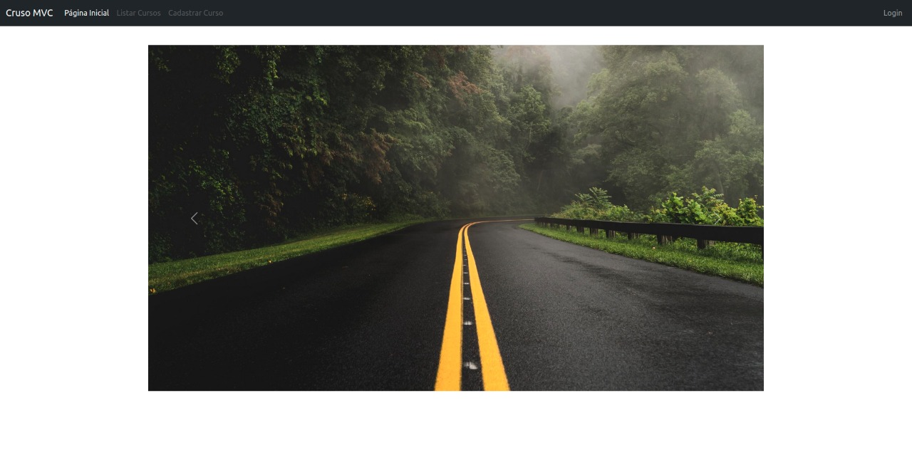

<h1 align="center">
    
    <br>E-Commerce Book Store<br/>
</h1>
<h3 align="center">
  🐘 PHP 8.0.7 | 🐬 MySQL 8.0 | 🎲 Doctrine ORM 2.6 | 🎨 Bootstrap 5.1
</h3>

<br/>

<p align="center">
    
    &nbsp;&nbsp;
    &nbsp;&nbsp;<br/><br/>
    <br/>
</p>
<br/>
<p align="center">
    &nbsp;&nbsp;&nbsp;| 🔗&nbsp;&nbsp;&nbsp;<a href="http://e-commerce.wgottschalt.com">e-commerce.wgottschalt.com</a>&nbsp;&nbsp;&nbsp;🔗 |&nbsp;&nbsp;&nbsp;
</p>
<br/>
<p align="center">
    
<p>
<br/>

## 📝 Sobre o Projeto

O _BookStore_ é um projeto desenvolvido como aprendizado, experiência e vivência na área de programação Web. Pensado para ser um plataforma de vendas online do tipo _E-Commerce_. Desenvolvido para ser simples e fácil de utilizar e entender.

### 📌 Liguagem e Padrões

Utilizando a linguagem de programação PHP na sua versão mais recente (8.0.7) com o banco de dados MySQL também em sua versão mais recente. O projeto segue os padrões de desenvolvimento web modernos. Seguindo o paradigma de Programação Orientada a Objetos e o padrão Model View Controller. Também foi atentado para seguir todas os padrões das PSRs do PHP.

### 🛠 Frameworks

O projeto preza por ser mais purista do PHP pois seu propósito é o aprendizado desta linguagem. Por este motivo, optei apenas por utilizar o Doctrine ORM para fazer o Mapeamento Objeto Relacional do Banco de Dados.

### 💡 _Mas, por que BookStore??_

Eu amo livros e quando precisei escolher um tema para meu E-Commerce não pensei duas vezes. É considerado um hábito muito saudável, pois mantém nossa mente ativa e com saúde.

"A leitura de conteúdos de boa qualidade alarga os horizontes da pessoa e amplia as suas possibilidades pela expansão de seu conhecimento, desenvolvimento intelectual e de sua visão de mundo, fortalecendo as convicções pessoais, a capacidade de argumentação e manifestação de opiniões com utilização de um vocabulário mais rico." - Wikipédia

Logo devemos incentivar a leitura, nos incentivar a ler, mesmo que seja um rótulo de shampoo, ou um artigo de jornal velho.

### 📝 O Projeto

Este projeto foi proposto durante o curso _Técnico em Informática_, pelo professor [Dionatan Henrique Santos](#), na turma 424 - competência C4C4 na [Escola Técnica Estadual 25 de Julho](https://escola25dejulho.com.br/tecnico.php?id=1).

## 🧰 Tecnologias Utilizadas

- [PHP](https://www.php.net/)
- [MySQL](https://www.mysql.com/)
- [Composer](https://getcomposer.org/)
- [Doctrine ORM](https://www.doctrine-project.org/projects/orm.html)
- [Doctrine Migrations](https://www.doctrine-project.org/projects/migrations.html)
- [PHP dotenv](https://github.com/vlucas/phpdotenv)

## 🚀 Como Executar o Projeto

### ✅ 1. _Pré-requisitos_

  - É _necessário_ possuir o **[Docker](https://www.docker.com/)** instalado no computador.
  - É _necessário_ possuir o **[Docker Compose](https://docs.docker.com/compose/install/)** instalado no computador.
    - Opcionalmente você pode optar por instalar um servidor apache ou nginx e o PHP diretamente em seu computador, porém serão necessárias configurações adicionais. Uma alternativa podem ser aplicativos como XAMPP e etc...
  - Por fim, é _essencial_ ter o **[Git](https://git-scm.com/)** instalado e configurado no computador.

### 2. Faça um clone do repositório:

```sh
  $ git clone https://github.com/WernerLuiz92/E-Commerce_BookStore__V2.git
```

### 3. Executando os conteiners da Aplicação:

Siga os passos deste tutorial:
    
[Executando os Containers](.github/docs/containers.md)

### 4. Aliases 

Se preferir, você pode configurar no arquivo de configurações do seu terminal ( `~/.zshrc` ou `~/.bashrc` ) alguns _aliases_ que facilitam a execução do projeto.

```sh
# BookStore aliases
alias bks="cd /path/to/the/project/e-commerce_bookstore"
alias bks-up="bks; docker-compose up -d"
alias bks-down="bks; docker-compose down"
alias bks-dev="bks-up; code ."
alias bks-shell="docker container exec -it BookStore-webServer bash"
```

### 5. Executando a Aplicação:
    
```sh
  # Acessando o Shell do container webServer
  $ docker container exec -it BookStore-webServer bash
 
  # Instalando as dependências do projeto.
  $ composer install
    
  # Atualizando o autoload do composer
  $ composer dump-autoload

  # Executando as migrations
  $ vendor/bin/doctrine-migrations migrations:migrate
    
```

### 6. Pronto
    
É só acessar [`http://localhost/`](http://localhost/) e pronto!
    
<br/><br/>
    
## 🖋 Licença

Esse projeto está sob a licença MIT. Veja o arquivo [LICENSE](LICENSE) para mais detalhes. <br/><br/>


---

<sup>Projeto desenvolvido por [Werner Luiz Gottschalt](https://www.linkedin.com/in/werner-gottschalt/), desenvolvedor FullStack PHP, Laravel, VueJS, MySQL em [Lumiun Tecnologia](https://www.lumiun.com).</sup>
